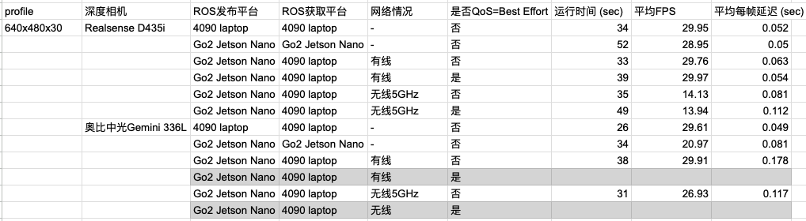

# Testing Realsense / Orbbec depth camera under ROS

<div align="center">
  <div style="">
      
  </div>
  <br/>
</div>

1. Realsense on Ubuntu 24.04
+ Installation
```
    # https://github.com/IntelRealSense/realsense-ros/tree/ros2-development

    # first, ROS 2 does not work with conda environment, so we need to better have python 3.11
        # ubuntu 24.04 gets you python 3.12

        # laptop4 originally has python3.11 in conda and python3.12
        # ROS2 says it cannot work with anaconda
            https://docs.ros.org/en/jazzy/How-To-Guides/Using-Python-Packages.html

        # you cannot change the system python version since apt-get relies on it

    1. Install ROS2 Jazzy for Ubuntu 24 (conda deactivate, with system python3.12)
        https://docs.ros.org/en/jazzy/Installation/Ubuntu-Install-Debs.html

        # uninstall
            sudo apt remove ~nros-jazzy-* && sudo apt autoremove

        $ sudo apt install software-properties-common
        $ sudo add-apt-repository universe
        ...

        $ sudo apt install ros-jazzy-desktop

        1.2. Setup Environment
            # everytime you need to source the ros2 stuff

            $ source /opt/ros/jazzy/setup.bash

        1.3. Test
            Screen 1: send some info as topic using C++ API
                $ source /opt/ros/jazzy/setup.bash
                $ ros2 run demo_nodes_cpp talker

            Screen 2: receive the message using Python API
                $ source /opt/ros/jazzy/setup.bash
                $ ros2 run demo_nodes_py listener

        # check your ROS2 is using the python version you normally use
            $ ls /opt/ros/jazzy/lib/python3.12/

            # the python package for ROS 2 is rclpy
                # you will need to conda deactivate to import rclpy
                >>> rclpy.__path__
                ['/opt/ros/jazzy/lib/python3.12/site-packages/rclpy']

    2. Install Realsense SDK 2.0
        # need to build from source on Ubuntu 24.04:
            https://github.com/IntelRealSense/realsense-ros/tree/ros2-development?tab=readme-ov-file#option-3-build-from-source

                https://github.com/IntelRealSense/librealsense/blob/master/doc/installation.md

        # clone the github repo librealsense and install

            # Note: The shared object will be installed in /usr/local/lib, header files in /usr/local/include.
            # The binary demos, tutorials and test files will be copied into /usr/local/bin

            # install - also build the python 3.12 wrapper
                #  install pyrealsense wrapper, for python3.12 we need to build from source\
                    # https://github.com/IntelRealSense/librealsense/tree/master/wrappers/python#building-from-source

                $ mkdir build && cd build
                $ cmake ../ -DCMAKE_BUILD_TYPE=Release -DBUILD_PYTHON_BINDINGS:bool=true -DPYTHON_EXECUTABLE=/usr/bin/python3
                $ sudo make uninstall && make clean && make -j8 && sudo make install

                    # pyrealsense2 is installed to '/usr/local/lib/python3.12/dist-packages/pyrealsense2'

                    # copy librealsense/build/Release/*.so* lib to the system python, add __init__.py file

                        junweil@precognition-laptop4:~$ sudo cp ./projects/realsense/librealsense/build/Release/pyrealsense2.cpython-312-x86_64-linux-gnu.so* /usr/local/lib/python3.12/dist-packages/pyrealsense2/

                        junweil@precognition-laptop4:~/projects/realsense/librealsense/build/Release$ sudo vi /usr/local/lib/python3.12/dist-packages/pyrealsense2/__init__.py

                            # py libs (pyd/so) should be copied to pyrealsense2 folder
                            from .pyrealsense2 import *

                        $ ls /usr/local/lib/python3.12/dist-packages/pyrealsense2
                        __init__.py                                          pyrsutils.cpython-312-x86_64-linux-gnu.so
                        pyrealsense2.cpython-312-x86_64-linux-gnu.so         pyrsutils.cpython-312-x86_64-linux-gnu.so.2.55
                        pyrealsense2.cpython-312-x86_64-linux-gnu.so.2.55    pyrsutils.cpython-312-x86_64-linux-gnu.so.2.55.1
                        pyrealsense2.cpython-312-x86_64-linux-gnu.so.2.55.1

                # if set -DPYTHON_EXECUTABLE=/home/junweil/anaconda3/bin/python
                    # pyrealsense2 is installed to /home/junweil/anaconda3/lib/python3.12/site-packages/pyrealsense2

                    # we need to install this for system python


        # test:
            realsense-viewer  # check latency qualitatively
            python - import pyrealsense2

    3. Install Realsense ROS package
        # install from source to have a latency test tool - nope, the latency is running locally, not useful
        # install from apt install
            # https://github.com/IntelRealSense/realsense-ros/tree/ros2-development?tab=readme-ov-file#option-1-install-debian-package-from-ros-servers-foxy-eol-distro-is-not-supported-by-this-option

            $ sudo apt install ros-jazzy-realsense2-*

            # this will install the realsense ros stuff to
                # ['/opt/ros/jazzy']

    #### note we may need to conda deactivate to use ROS python

```
+ Testing
```
    # Realsense ROS 2 documentation: https://dev.intelrealsense.com/docs/ros2-wrapper
        # code: https://github.com/IntelRealSense/realsense-ros

    1. running the RGBD Topic in one process

        # https://github.com/IntelRealSense/realsense-ros/tree/ros2-development?tab=readme-ov-file#rgbd-topic

        $ conda deactivate
        $ source /opt/ros/jazzy/setup.bash

        junweil@precognition-laptop4:~/projects/realsense$ ros2 launch realsense2_camera rs_launch.py enable_rgbd:=true enable_sync:=true align_depth.enable:=true enable_color:=true enable_depth:=true depth_module.depth_profile:=640x480x30 rgb_camera.color_profile:=640x480x30 camera_namespace:=go2 camera_name:=d435i

            # depth_qos:=SENSOR_DATA color_qos:=SENSOR_DATA
                # so this can be best_effort, higher frame rate?

            # depth_module.depth_profile:=640x480x30 rgb_camera.color_profile:=640x480x30

            # camera_namespace:=robot1 camera_name:=D455_1
            # so you get /robot1/D455_1 node

            # to see this code: https://github.com/IntelRealSense/realsense-ros
                # realsense2_camera/launch/rs_launch.py

        $ ros2 topic list
            /camera/camera/aligned_depth_to_color/camera_info
            /camera/camera/aligned_depth_to_color/image_raw
            /camera/camera/color/camera_info
            /camera/camera/color/image_raw
            /camera/camera/color/metadata
            /camera/camera/depth/camera_info
            /camera/camera/depth/image_rect_raw
            /camera/camera/depth/metadata
            /camera/camera/extrinsics/depth_to_color
            /camera/camera/rgbd
            /parameter_events
            /rosout
            /tf_static

                # RGBD Message
                std_msgs/Header header
                sensor_msgs/CameraInfo rgb_camera_info
                sensor_msgs/CameraInfo depth_camera_info
                sensor_msgs/Image rgb
                sensor_msgs/Image depth

        # check the Hz
            $ ros2 topic hz /camera/camera/aligned_depth_to_color/image_raw
            2 Hz - 25 Hz??
            $ ros2 topic hz /camera/camera/color/camera_info
            30 Hz
            $ ros2 topic hz /camera/camera/depth/image_rect_raw
            22 Hz
            $ ros2 topic hz /camera/camera/color/image_raw
            2-12 Hz

            # making it faster over ROS?
                https://github.com/IntelRealSense/librealsense/issues/10730

    2. listen to this message and visualize

        # need to install a package (first do $ conda deactivate)
            $ python3 -m pip install numpy-quaternion --break-system-packages

        2.1 use the example code

            junweil@precognition-laptop4:~/projects/realsense/realsense-ros/realsense2_camera/scripts$ python3 rs2_listener.py /camera/camera/color/image_raw

                # https://github.com/IntelRealSense/realsense-ros/blob/ros2-development/realsense2_camera/scripts/rs2_listener.py

            # show center depth

            junweil@precognition-laptop4:~/projects/realsense/realsense-ros/realsense2_camera/scripts$ python3 show_center_depth.py

        2.2 Run opencv to check the delay time,

            # on the same machine, delay time is ~0.05 second

                junweil@precognition-laptop4:~/projects/depth_cameras/depth_ros$ python3 image_listener.py

                # video:
                    https://github.com/JunweiLiang/depth_ros/blob/main/ros2_realsense_depth_delay_test.avi


```


2. Realsense on Jetsons
+ Installation
```
    1. Reboot the Jetson Nano 8GB on Go2 to set 25W power mode
        # Ubuntu 20.04, Jetpack 5.1.1
            # jtop to see status
        # can connect from the laptop in the same LAN
            $ ssh unitree@192.168.123.18
            pwd: 123

    2. Install ROS 2
        # no need, go2 already has ROS 2
            (go2) unitree@ubuntu:~$ ls /opt/ros/foxy/

        # python 3.8

    3. Install Realsense SDK
        # use apt install, easy with network
            https://github.com/IntelRealSense/librealsense/blob/master/doc/installation_jetson.md

        3.1 install pyrealsense2
            # 换清华源
                pip config set global.index-url https://mirrors.tuna.tsinghua.edu.cn/pypi/web/simple
            # (go2) unitree@ubuntu:~$ pip install pyrealsense2

        3.2 测试pyrealsense under GUI
            # clone this: https://github.com/JunweiLiang/tennis_project

            (go2) unitree@ubuntu:~/projects/tennis_project$ python get_depth_images.py

            # FPS 27+

    4. Install Realsense ROS package

        $ sudo apt install ros-foxy-realsense2-*

```
+ Testing
```
    # Test with local ROS visualization and see the delay

    1. run the data publisher in one screen session

        (go2) unitree@ubuntu:~/projects/tennis_project$ ros2 launch realsense2_camera rs_launch.py enable_rgbd:=true enable_sync:=true align_depth.enable:=true enable_color:=true enable_depth:=true depth_module.depth_profile:=640x480x30 rgb_camera.color_profile:=640x480x30 camera_namespace:=go2 camera_name:=d435i

            # depth_qos:=SENSOR_DATA color_qos:=SENSOR_DATA
                # so this can be best_effort, we can get lower latency and higher framerate

            # depth_module.depth_profile:=640x480x30 rgb_camera.color_profile:=640x480x30

            # camera_namespace:=robot1 camera_name:=D455_1
            # so you get /robot1/D455_1 node

            # to see this code: https://github.com/IntelRealSense/realsense-ros
                # realsense2_camera/launch/rs_launch.py

    2. run the subscriber to visualize
        # Jetson Nano换成25W模式，最大功率
        # 注意狗子上的路由器，一定要接5V/3A的电源，5V/2A的电源，功率受限会经常断开wifi

        # nano local run, ~0.05-0.06 second delay, 27 FPS
            # cmd
                (go2) unitree@ubuntu:~/projects/depth_ros$ python image_listener.py --save ros2_realsense_depth_delay_test_besteffort_ongo2nano.avi

            # video
                ros2_realsense_depth_delay_test_ongo2nano.avi


        # on laptop4 with wired connection to LAN, we can directly see this ros topic (需要重启laptop4，才能有线连上路由器)

            # 0.14 second delay, 29 FPS
                # video: ros2_realsense_depth_delay_test_onlaptop4+overwiredgo2nano.avi

            # best effort, got 0.0001 second delay??
                # video: ros2_realsense_depth_delay_test_besteffor_onlaptop4+overwiredgo2nano.avi

        # wifi test
            # use a USB wifi connector, disable the laptop one
                $ sudo ifconfig wlp59s0f0 down
            # no need

            # cmd
                junweil@precognition-laptop4:~/projects/depth_cameras/depth_ros$ python3 image_listener.py --save ros2_realsense_depth_delay_test_besteffort_onlaptop4+overwifigo2nano.avi

             # over wifi, FPS is ~10, , delay is 0.14 second,  video:
                ros2_realsense_depth_delay_test_onlaptop4+overwifigo2nano.avi
            # best effort is FPS ~15, delay 0.11 second, video:
                ros2_realsense_depth_delay_test_besteffort_onlaptop4+overwifigo2nano.avi
```

3. Orbbec on Ubuntu 24.04
+ Installation
```
    # https://github.com/orbbec/OrbbecSDK_ROS2
    # python sdk: https://github.com/orbbec/pyorbbecsdk

    1. ROS 2 installation done

    2. Install Orbbec ROS 2 package

        # see full instruction here: https://github.com/orbbec/OrbbecSDK_ROS2?tab=readme-ov-file#installation-instructions

        junweil@precognition-laptop4:~/projects/depth_cameras/orbbec_ros2_ws/src$ git clone https://github.com/orbbec/OrbbecSDK_ROS2.git

        ..
        junweil@precognition-laptop4:~/projects/depth_cameras/orbbec_ros2_ws$ colcon build --event-handlers  console_direct+  --cmake-args  -DCMAKE_BUILD_TYPE=Release


    3. Install Python SDK
        # make a python wheel to install
            https://github.com/orbbec/pyorbbecsdk?tab=readme-ov-file#making-a-python-wheel

            # open3D does not support python3.12 yet, ignored

            installed to
                /home/junweil/.local/lib/python3.12/site-packages/pyorbbecsdk.cpython-312-x86_64-linux-gnu.so
```
+ Testing
```
    # we use Orbbec Gemini 336L: https://www.orbbec.com/products/stereo-vision-camera/gemini-336l/
    # ROS2 下掉帧？https://github.com/orbbec/OrbbecSDK_ROS2/blob/main/docs/fastdds_tuning.md

    1. start the camera publishing

        # need to source two thing
            $ source ros2
            junweil@precognition-laptop4:~/projects/depth_cameras/orbbec_ros2_ws$ . ./install/setup.bash

        junweil@precognition-laptop4:~/projects/depth_cameras/orbbec_ros2_ws$ ros2 launch orbbec_camera gemini_330_series.launch.py

        # other launch file
            junweil@precognition-laptop4:~/projects/depth_cameras/orbbec_ros2_ws$ ls src/OrbbecSDK_ROS2/orbbec_camera/launch/

        # we have these topics
            junweil@precognition-laptop4:~/projects/depth_cameras/orbbec_ros2_ws$ ros2 topic list
            /camera/color/camera_info
            /camera/color/image_raw
            /camera/color/metadata
            /camera/depth/camera_info
            /camera/depth/image_raw
            /camera/depth/metadata
            /camera/depth_filter_status
            /camera/depth_to_color
            /diagnostics
            /parameter_events
            /rosout
            /tf
            /tf_static

        # launch params: https://github.com/orbbec/OrbbecSDK_ROS2?tab=readme-ov-file#launch-parameters

        junweil@precognition-laptop4:~/projects/depth_cameras/orbbec_ros2_ws$ ros2 launch orbbec_camera gemini_330_series.launch.py color_width:=640 color_height:=480 color_fps:=30 depth_width:=640 depth_height:=480 depth_fps:=30 enable_color:=true enable_depth:=true depth_registration:=true enable_spatial_filter:=false enable_temporal_filter:=false

        # 640x480x30 profile and depth align to color:
            color_width:=640 color_height:=480 color_fps:=30 depth_width:=640 depth_height:=480 depth_fps:=30 enable_color:=true enable_depth:=true depth_registration:=true

        # best effort [10/09/2024] this does not work, we need to run the default profile
            color_qos:=SENSOR_DATA depth_qos:=SENSOR_DATA

        #  enable_spatial_filter:=true enable_temporal_filter:=true does not seem to help

        # compressed image?
            https://github.com/orbbec/OrbbecSDK_ROS2?tab=readme-ov-file#compressed-image

        # getting synchronized image and depth
            https://github.com/orbbec/OrbbecSDK_ROS2/issues/37#issuecomment-2149734469

    2. run visualization

        junweil@precognition-laptop4:~/projects/depth_cameras/depth_ros$ python3 image_listener_orbbec.py


```

4. Orbbec on Jetson
+ Installation
```
    1. ROS 2 done.
    2. Install Orbbec ROS 2 package
        # https://github.com/orbbec/OrbbecSDK_ROS2?tab=readme-ov-file#installation-instructions

        (go2) unitree@ubuntu:~/projects/orbbec_ros2_ws/src$ git clone https://github.com/orbbec/OrbbecSDK_ROS2
        ...
        (go2) unitree@ubuntu:~/projects/orbbec_ros2_ws$ colcon build --event-handlers  console_direct+  --cmake-args  -DCMAKE_BUILD_TYPE=Release

    3. Install Python SDK

        (go2) unitree@ubuntu:~/projects$ git clone https://github.com/orbbec/pyorbbecsdk

        (go2) unitree@ubuntu:~/projects/pyorbbecsdk$ pip3 install -r requirements.txt
        ...

```
+ Testing
```

    1. Source the package and run ROS
        (go2) unitree@ubuntu:~/projects/orbbec_ros2_ws$ . ./install/setup.bash


        (go2) unitree@ubuntu:~/projects/orbbec_ros2_ws$ ros2 launch orbbec_camera gemini_330_series.launch.py color_width:=640 color_height:=480 color_fps:=30 depth_width:=640 depth_height:=480 depth_fps:=30 enable_color:=true enable_depth:=true depth_registration:=true enable_spatial_filter:=false enable_temporal_filter:=false

        # the output should end with
            ...
            [orbbec_camera_node-1] [INFO] [1728466810.890109637] [camera.ob_camera_node]: Publishing static transform from depth to depth
            [orbbec_camera_node-1] [INFO] [1728466810.890903807] [camera.ob_camera_node]: Translation 0, 0, 0
            [orbbec_camera_node-1] [INFO] [1728466810.891722234] [camera.ob_camera_node]: Rotation 0, 0, 0, 1


    2. Run visualization (local)
```
